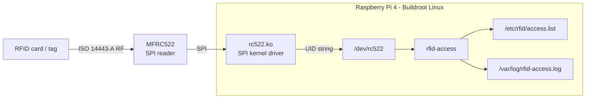
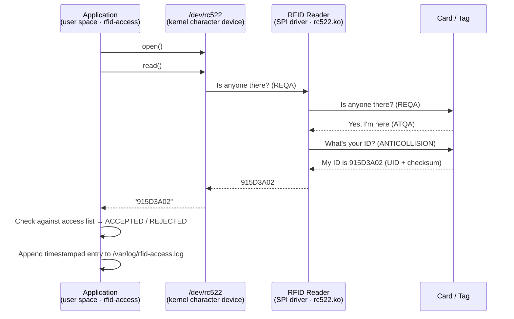
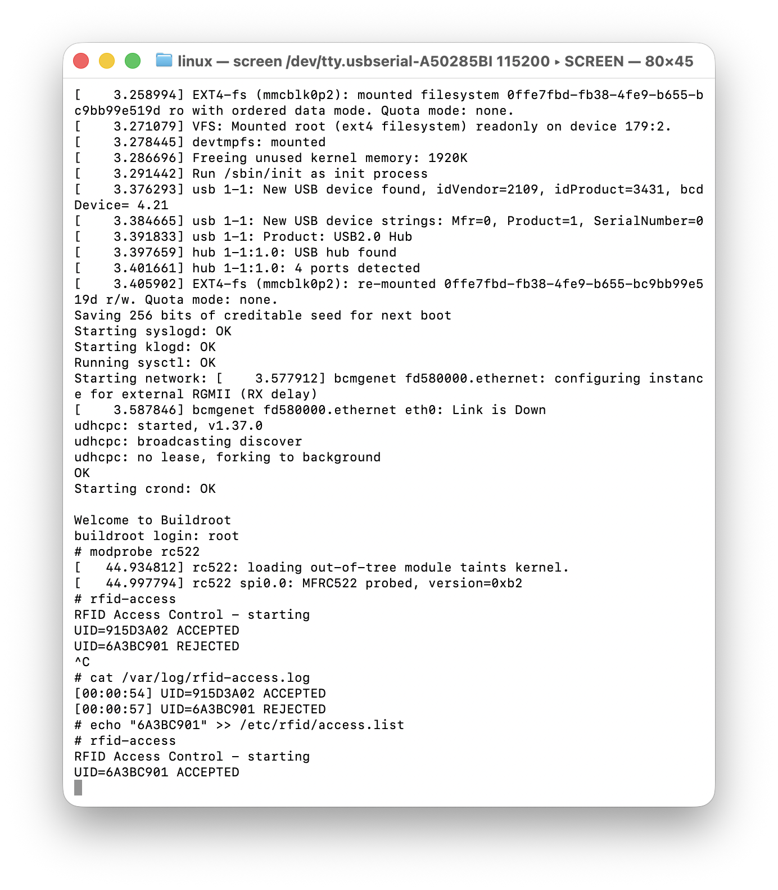

# Embedded Linux RFID Access Control



## Overview

Embedded Linux system for RFID access control running on a Raspberry Pi 4. The entire stack is built from source with **Buildroot**: toolchain, kernel, BusyBox, root filesystem, device tree overlay, kernel module, and user space application, all in a single reproducible image. No prebuilt distro, no package manager.

- Builds the full system image from source using **Buildroot** with a `br2-external` tree and a `defconfig`. Fully reproducible inside a **Docker devcontainer**.
- Custom **Linux SPI kernel driver** for the MFRC522: device tree binding, `probe`/`remove` lifecycle, character device, and ISO 14443-A card detection. UID delivered to user space via `/dev/rc522`.
- **ISO 14443-A** communication sequence (REQA, ANTICOLLISION) implemented directly against the MFRC522 register map over SPI.
- User space **C application** polls `/dev/rc522`, checks the UID against `/etc/rfid/access.list`, and appends a timestamped entry to `/var/log/rfid-access.log`.


## Stack

| Layer | Technology |
|-------|-----------|
| Build system | Buildroot (`br2-external`, `defconfig`) |
| Kernel driver | Linux SPI driver, character device, device tree overlay |
| Protocol | ISO 14443-A (REQA → ANTICOLLISION → UID) |
| User space | C application, access list, structured log |
| Build environment | Docker devcontainer |

## Hardware

| Component | Details |
|-----------|---------|
| SBC | Raspberry Pi 4 Model B |
| RFID reader | MFRC522 (NXP) over SPI |
| Tokens tested | ISO 14443-A card and keyfob tag |
| Debug | FTDI USB-UART on GPIO14/15 |

### Wiring

| MFRC522 | RPi4 pin | GPIO |
|---------|----------|------|
| VCC | Pin 1 | 3.3 V |
| GND | Pin 6 | GND |
| MISO | Pin 21 | GPIO9 |
| MOSI | Pin 19 | GPIO10 |
| SCK | Pin 23 | GPIO11 |
| SDA/NSS | Pin 24 | GPIO8 (CE0) |
| RST | Pin 22 | GPIO25 |

## Card Detection Sequence



## Design Decisions

- When no card is present, the chip's built-in hardware timer triggers the timeout. The CPU is not spinning in a loop waiting. It sleeps between checks, keeping CPU usage near zero while the reader is idle.
- The driver signals end-of-data after each card read, following the standard Unix character device pattern. The application therefore opens `/dev/rc522` fresh on every scan cycle rather than holding the file descriptor open.
- The Raspberry Pi 4 has no battery-backed RTC, so the wall clock starts at 1970-01-01 on every boot until an NTP sync happens. The log uses time-since-boot (`CLOCK_BOOTTIME`) instead, which is always valid and matches the format of the kernel boot messages.
- A 2-second debounce prevents the same card held on the reader from flooding the log with duplicate entries.

## Project Structure

```
embedded-linux-rfid-access-control/
├── .devcontainer/
├── board/
│   ├── config.txt                # RPi4 boot config
│   ├── rootfs-overlay/           # Files overlaid onto the rootfs
│   └── rpi-4/
│       ├── post-build.sh         # Compiles rc522-overlay.dtbo
│       └── rc522-overlay.dts     # Device tree overlay
├── buildroot/                    # Buildroot submodule
├── configs/
│   └── rfid_rpi4_defconfig       # Buildroot defconfig
├── package/
│   ├── apps/rfid-access/         # User space package
│   │   └── src/main.c
│   └── drivers/rc522/            # Kernel module package
│       └── src/rc522.c
├── Config.in
├── external.desc
└── external.mk
```

## Build

**Prerequisites:** Docker Desktop, VS Code with Dev Containers extension.

```bash
git clone --recurse-submodules https://github.com/miguel-sergio/embedded-linux-rfid-access-control
cd embedded-linux-rfid-access-control

# Reopen in Dev Container

# Inside container
cd /workspace/buildroot
make rfid_rpi4_defconfig
make
```

Flash the image (macOS):

- Use Raspberry Pi Imager

## Demo

Connect the MFRC522, insert the SD card, open a serial console at 115200 baud:

```bash
modprobe rc522
rfid-access
```

Present a card:

```
RFID Access Control - starting
UID=915D3A02 ACCEPTED
UID=6A3BC901 REJECTED
```

```bash
cat /var/log/rfid-access.log
[00:01:32] UID=915D3A02 ACCEPTED
[00:01:45] UID=6A3BC901 REJECTED
```

Add a card to the access list:

```bash
echo "6A3BC901" >> /etc/rfid/access.list
```


